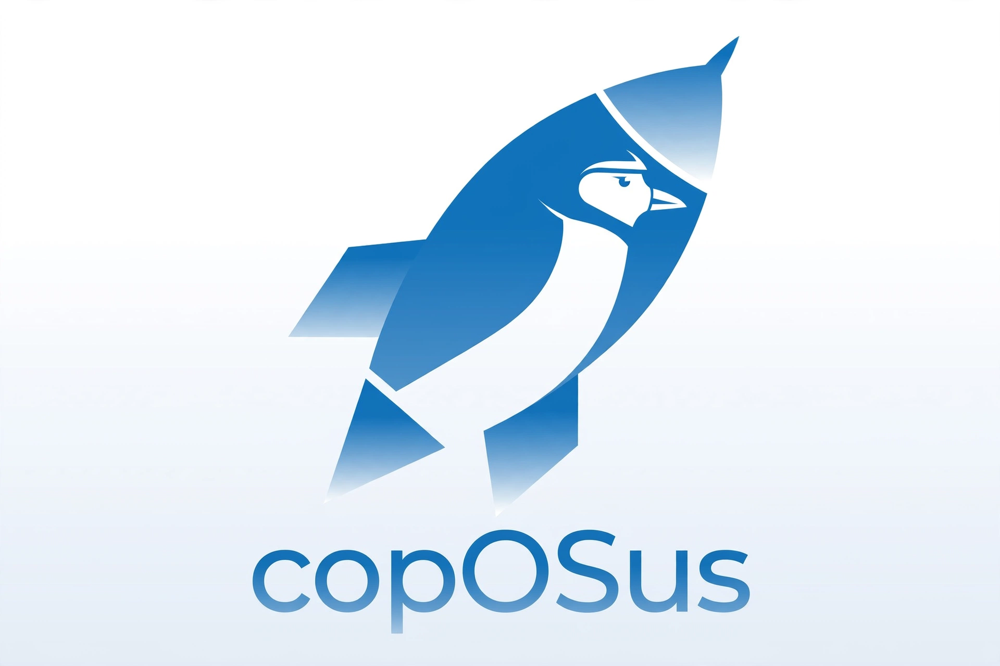

# 🌟 copOSus

  

### **CachyOS tuned for ex-Windows/Mac users**

**copOSus** is an operating system based on **CachyOS**, specifically designed to provide a smooth, powerful, and seamless transition for users migrating from Windows or macOS to Linux. It combines the extreme performance of CachyOS with the familiar, polished aesthetics of **KDE Plasma** and an innovative, built-in Artificial Intelligence installation assistant.

---

## 🚀 Download
You can download the official ISO image directly from the following link:

👉 **[Download copOSus (Google Drive)](https://google.com)**

---

## ✨ Key Features

### 🧠 Built-in Optimization AI (Exclusive)
Unlike traditional distributions that rely on static, rigid scripts that can break system dependencies, **copOSus features a custom Artificial Intelligence engine integrated directly into the installer**.
* Guides you step-by-step through the setup.
* Analyzes your hardware configuration and user needs in real-time.
* Intelligently tunes and optimizes system parameters out of the box.

### 🎨 Familiar KDE Plasma Environment
The OS comes pre-configured with the **KDE Plasma** desktop environment. It offers a modern, clean, and fluid interface that provides a familiar workflow for long-time Windows and macOS users while retaining full customization potential.

### ⚡ CachyOS Performance Under the Hood
Built on top of CachyOS (an optimized Arch Linux derivative), copOSus inherits heavily optimized kernels compiled with support for advanced CPU architectures (like x86-64-v3 and v4). This ensures lightning-fast responsiveness for gaming, coding, and daily tasks.

---

## 📸 Screenshots
*(Coming Soon! This section will showcase the AI assistant installer interface and the customized KDE Plasma desktop)*

---

## 🛠️ Quick Installation Guide

1. **Download the ISO** from the Google Drive link provided above.
2. **Flash the image** onto a USB drive using reliable tools like Ventoy, Rufus, or BalenaEtcher.
3. **Boot from the USB drive** by entering your computer's boot menu.
4. **Follow the AI prompt** inside the installer to easily configure the OS tailored to your hardware and preferences.
5. Reboot and enjoy a blazing-fast Linux system designed just for you!

---

## 💬 Developer's Note

This system is optimized and built with a lot of effort for anyone who wants to give it a try. I will actively release updates as long as the project gets downloads and traction. 

If you give it a try, please let me know your thoughts, report bugs in the *Issues* section, or show your support by leaving a **⭐ Star** on this repository!
